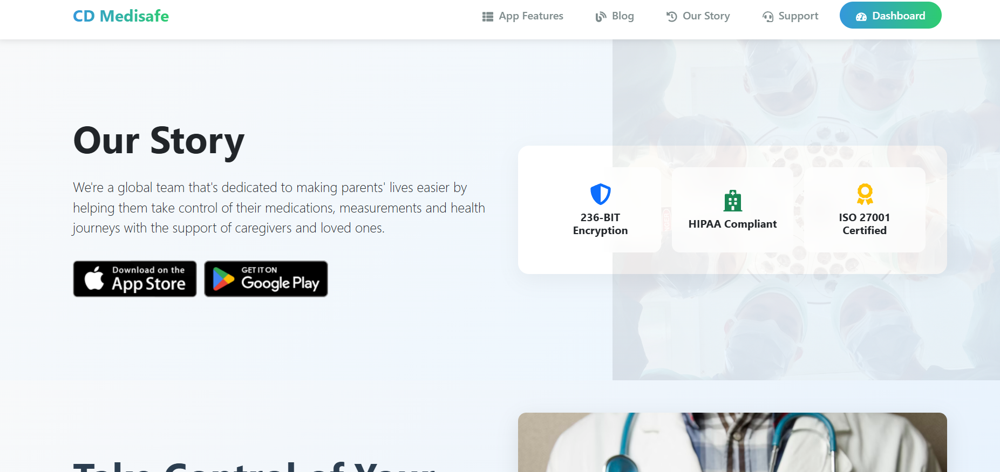
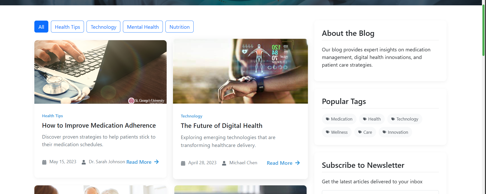
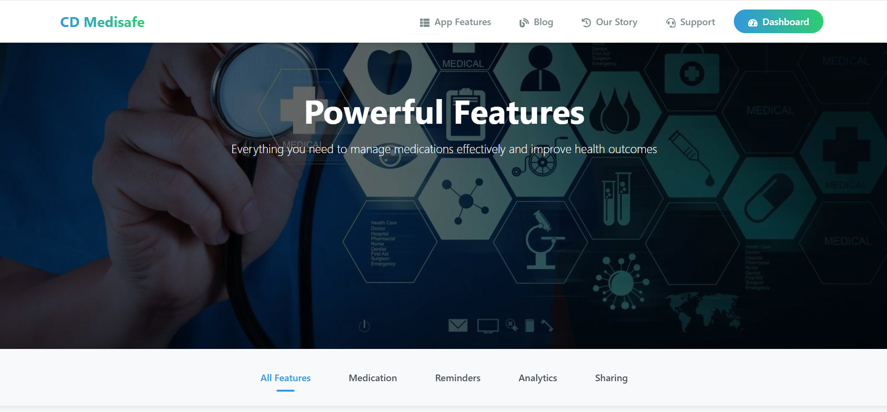
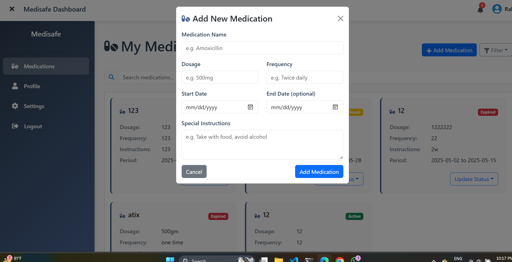
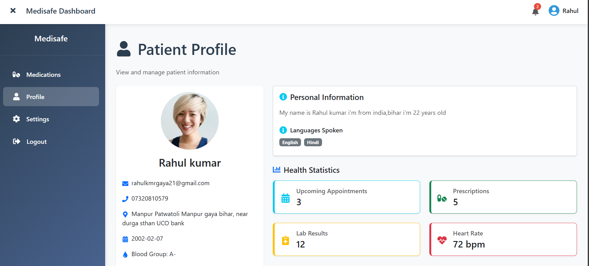
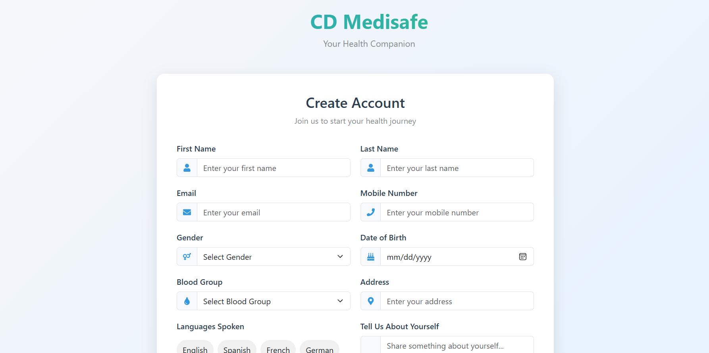

# 💊 Prescription and Medication Management Tool – Frontend

A responsive and user-friendly medication management web application built using React.js and Firebase.

---

##  Live Demo

[Click here to view the app](https://medication-management-tool.vercel.app/)

---

## 🛠️ Tech Stack

- **React.js (Vite)** – Fast and modern frontend development
- **Redux Toolkit** – Efficient and scalable state management
- **Firebase Realtime Database** – For storing and syncing medication data
- **React Bootstrap** – Responsive and styled UI components
- **Framer Motion** – Smooth and elegant animations
- **Font Awesome** – Clean and intuitive icons

---

## ✨ Features

### 📋 Medication Management

- **Add Medications**: Enter name, dosage, frequency, and instructions.
- **View Medications**: Displayed in a responsive card layout.
- **Filter & Search**: Search by medication name or filter by status (Active, Expired, Completed, Missed).
- **Update Status**: Easily change medication status from a dropdown.

### 🎨 UI/UX

- **Responsive Design**: Optimized for mobile, tablet, and desktop.
- **Animated Transitions**: Using Framer Motion.
- **Status Badges**: Color-coded indicators for quick status recognition.
- **Intuitive Icons**: Powered by Font Awesome.

---

## ⚙️ Key Highlights

- 🔄 Real-time data updates with **Firebase**
- 🔧 Global state handling via **Redux Toolkit**
- 📄 Built with **React + Vite** for optimized performance
- 📚 Pagination support for better list handling

---

## 🚀 Getting Started

Follow the steps below to run the project locally:

```bash
# Step 1: Clone the repository
git clone https://github.com/RahulkrWD/medication-management-tool.git

# Step 2: Navigate into the project directory
cd medication-management-tool

# Step 3: Install dependencies
npm install

# Step 4: Start the development server
npm run dev
```

# 📸 Screenshots ### Customer Interface








### Video presentation link of project

[Video link](https://drive.google.com/file/d/1GCtE7FKHGDnRFXuBqNvQdE5MdPkIrPB_/view?usp=sharing)
